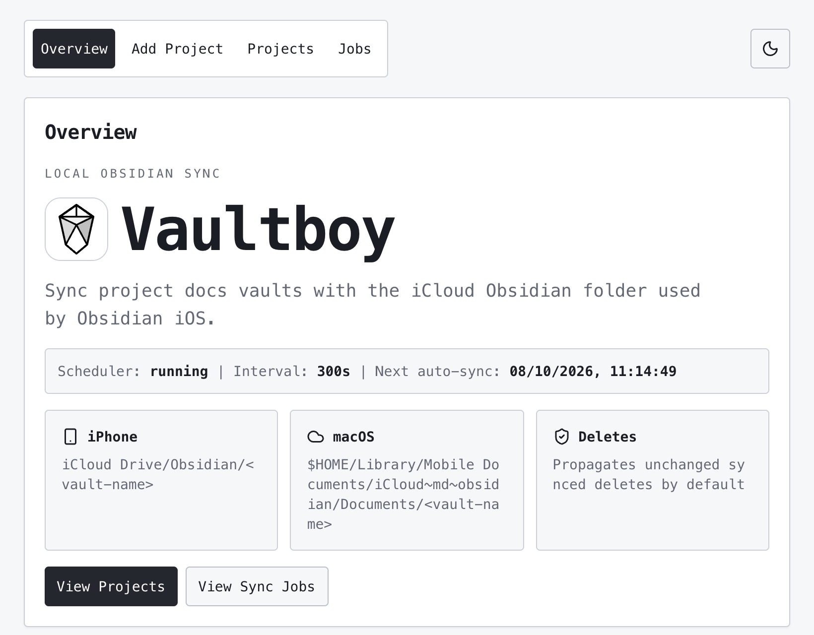
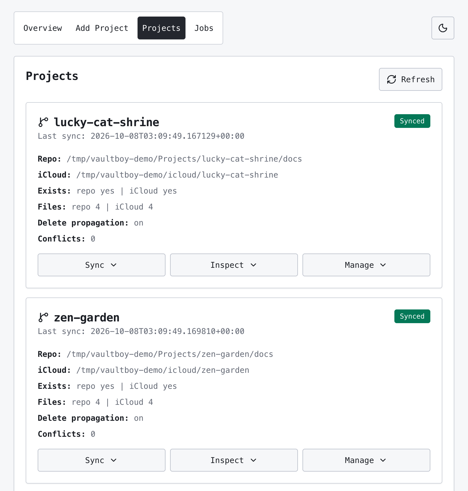

# vaultboy

A local macOS utility that keeps a repo's Obsidian vault in sync with Obsidian
iOS. It copies one docs folder to and from the iCloud Obsidian location, keeps
both sides when they conflict, and refuses syncs that would delete too much.
It syncs only the configured docs folder, not the whole repo.





## Requirements

- macOS with iCloud Drive and the Obsidian app on your iPhone.
- Python 3.12 or newer.
- Node, for the web UI.
- Rust (`brew install rust`), only for the desktop app.

## Install

```bash
git clone https://github.com/wynlo/vaultboy.git
cd vaultboy
./vaultboy
```

The launcher creates `.venv`, installs the Python and UI dependencies, and
starts the app. Manual install:

```bash
python3.12 -m venv .venv
.venv/bin/python -m pip install -e .
cd vaultboy_ui && npm install && npm run build
```

## Usage

```bash
./vaultboy                    # dev mode: Vite hot reload, FastAPI auto reload
./vaultboy --prod             # build the UI and serve it from FastAPI
./vaultboy --app              # build Vaultboy.app
./vaultboy --app --open       # build Vaultboy.app and open it
```

Open the web UI and add a project:

```text
Project name:      example-project
Repo docs path:    /Users/me/Projects/example-project/docs
iCloud vault path: /Users/me/Library/Mobile Documents/iCloud~md~obsidian/Documents/example-project
Enabled:           on
```

The repo docs path must exist. Vaultboy creates the iCloud vault path if it is
missing.

| Mode | URL |
|---|---|
| Dev UI | `http://127.0.0.1:5173` |
| Dev API | `http://127.0.0.1:4567` (redirects `/` to Vite) |
| Production | `http://127.0.0.1:4567` |

### iCloud location

The vault must be in the Obsidian folder (the one with the Obsidian icon), not
a plain iCloud Drive folder.

| Device | Path |
|---|---|
| iPhone | `iCloud Drive/Obsidian/<vault-name>` |
| macOS | `~/Library/Mobile Documents/iCloud~md~obsidian/Documents/<vault-name>` |

### Sync modes

| Mode | Description |
|---|---|
| Pull | Copy from iCloud Obsidian to repo docs. |
| Push | Copy from repo docs to iCloud Obsidian. |
| Safe sync | Pull, then push. |
| Dry run | Report the planned work. Copy nothing. |
| Force sync | Apply a sync that the delete guard refused. |

### Recommended workflow

1. Edit notes on iPhone in Obsidian.
2. Let iCloud sync to the Mac.
3. Vaultboy pulls the changes into `repo/docs`.
4. Review `git diff` and commit.
5. Vaultboy pushes `repo/docs` back to iCloud.

Git stays the source of truth for `repo/docs`. Vaultboy does not replace
`git diff`, code review or commits.

## Configuration

`~/.vaultboy/config.json`. Restart after a change.

```json
{
  "host": "127.0.0.1",
  "port": 4567,
  "intervalSeconds": 300,
  "apiToken": "",
  "projects": [
    {
      "name": "example-project",
      "repoVaultPath": "/Users/me/Projects/example-project/docs",
      "icloudVaultPath": "/Users/me/Library/Mobile Documents/iCloud~md~obsidian/Documents/example-project",
      "enabled": true,
      "propagateDeletes": true
    }
  ]
}
```

| Field | Default | Description |
|---|---|---|
| `host` | `127.0.0.1` | Bind address. Set `0.0.0.0` for LAN or Tailscale access. |
| `port` | `4567` | API and production UI port. |
| `intervalSeconds` | `300` | Auto-sync interval. |
| `apiToken` | empty | If set, mutating API calls require this token. Reads stay open. |
| `propagateDeletes` | `true` | Per project. If `false`, deleted counterparts are skipped. |

| File | Path |
|---|---|
| Config | `~/.vaultboy/config.json` |
| State | `~/.vaultboy/state/<project-name>/manifest.json` |
| Logs | `~/.vaultboy/logs/vaultboy.log` |

## Features

- **Conflict copies.** If both sides changed since the last sync, Vaultboy
  keeps both and writes `original-name.conflict-YYYYMMDD-HHMMSS.md`. The UI
  and the log show each conflict.
- **Delete propagation.** A file removed on one side deletes the unchanged
  counterpart. Changed files are never deleted automatically. Tombstones
  expire after 30 days.
- **Delete guards.**
  - Evicted iCloud files (`.name.icloud` placeholders) are not deletions.
    Vaultboy requests the download and skips them until they are back
    (`evicted:` in job details).
  - A sync that would delete more than `max(5, 20%)` of tracked files stops
    and lists the planned deletions. Use dry run or compare, then Force sync.
  - If one side scans empty while the other has files, delete propagation is
    off for that pass.
- **iPhone access.** Open `http://<mac-lan-ip>:5173` (dev) or `:4567` (prod),
  or use your Mac's Tailscale name. The UI asks for `apiToken` once and keeps
  it in the browser. Expose Vaultboy on trusted networks only.
- **Desktop app.** A Tauri app that bundles the backend as a PyInstaller
  sidecar. No Python or terminal is required to run it. On launch it attaches
  to a backend already on the port (dev mode or launchd), or starts its own
  and stops it on quit. Output:
  `vaultboy_desktop/src-tauri/target/release/bundle/macos/Vaultboy.app`.
  The app is unsigned. To distribute it, you need Developer ID signing and
  notarization.
- **Launchd agent.** Runs `./vaultboy --prod` at login, without sudo, so sync
  continues with no app open. Logs go to `~/.vaultboy/logs/`.

  ```bash
  ./scripts/install-launchd.sh
  ./scripts/uninstall-launchd.sh
  ```

- **Ignored paths.** `.git`, `node_modules`, build folders, `dist`, `.next`,
  `target`, `.venv`, `__pycache__`, `.DS_Store`, and Obsidian workspace, cache
  and plugin state.

## Development

```bash
./vaultboy                         # hot reload
.venv/bin/python -m pytest tests   # sync engine tests
```

Use the Vite URL for code reloads. Vite proxies `/api` to port 4567.

## Troubleshooting

- **Edits from iPhone do not arrive.** iOS is not an always-on sync daemon.
  Background limits, battery, network and iCloud scheduling can delay files.
  Let iCloud finish syncing to the Mac before you expect a pull.
- **Sync refused with planned deletions.** The mass-delete guard stopped it.
  Check with dry run, then use Force sync if the deletions are intended.
- **Files show as `evicted:`.** "Optimize Mac Storage" removed them locally.
  They sync after iCloud downloads them again.

## Limitations

No database, no file watcher and no native iOS app. Sync is periodic plus
manual actions. The only authentication is the optional `apiToken`.
